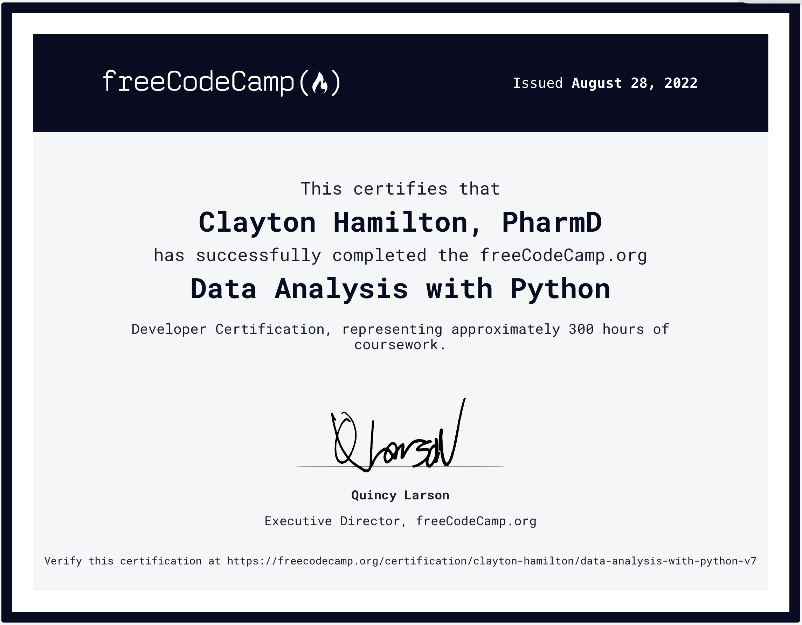

# Data Analysis With Python

Programming is similar to learning a new language. Without daily practice we become rusty so to stay fresh it's ideal to practice your ABCs (Always Be Coding). FreeCodeCamp is great in that they offer a plethora of resources including the [Data Analysis with Python Certificate](https://www.freecodecamp.org/learn/data-analysis-with-python/#data-analysis-with-python-course). During this course I expanded my knowledge of data manipulation using Numpy and Pandas and visualization with Matplotlib and Seaborn. 

Random aside: data visualization with Python is useful in organizations who use Power BI (PBI) because it expands available visualizations and provides additional control unavailable with PBI's standard plots.

After didactic material and quizzes, the final projects to earn the FreeCodeCamp Data Analysis with Python certification included the following:

- Mean-Variance-Standard Deviation Calculator
- Demographic Data Analyzer
- Medical Data Visualizer
- Page View Time Series Visualizer
- Sea Level Predictor

